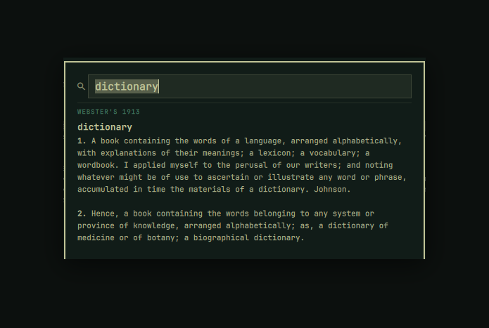

# Look Up

A macOS-style **dictionary lookup** popup for [Omarchy](https://omarchy.org).
Select a word anywhere (or just type one), press a hotkey, and get its
definition in a clean, theme-aware popup — offline, instantly.



Unlike a single-source lookup, Look Up is built around **multiple dictionaries
shown in an order you choose**, exactly like the source list in macOS
Dictionary. It ships with **Webster's 1913** as its offline base dictionary,
and you can add more and reorder them whenever you like.

## Features

- **macOS-style lookup** — reads the word you have highlighted (Wayland primary
  selection) and shows its definition; or type any word into the search box.
- **Multiple dictionaries, your order** — every dictionary in `config.json` is
  consulted and rendered as its own section, top to bottom, in list order.
- **Webster's 1913, fully offline** — ~102k headwords in a bundled SQLite
  database. No network, no API keys, no account. Nothing you look up leaves
  your machine.
- **Smart matching** — resolves inflections (`running` → *run*, `berries` →
  *berry*) and offers "did you mean…" suggestions when a word isn't found.
- **Theme-native** — colors, fonts, corners and borders all follow your active
  Omarchy theme automatically.
- **Keyboard-first** — type to search, `Enter` to look up, `Esc` to clear or
  close. Click a suggestion to jump to it. Click away or right-click to dismiss.

## Requirements

- Omarchy 4 / Quattro with `omarchy-shell`
- `wl-clipboard`, `jq`, `sqlite3`, `xz` (all ship with Omarchy)

## Install

```bash
omarchy plugin add https://github.com/keegan-sucks/omarchy-lookup.git --enable
```

Then add a keybinding. The fastest way — paste this **into a terminal** once; it
appends the binding to `~/.config/hypr/bindings.lua` (only if it isn't already
there) and reloads Hyprland:

```bash
grep -q 'keegan-sucks.lookup/lookup' ~/.config/hypr/bindings.lua 2>/dev/null ||
  cat >> ~/.config/hypr/bindings.lua <<'LUA'

-- Look Up dictionary plugin
o.bind("SUPER + ALT + L", "Look up word",
  os.getenv("HOME") .. "/.config/omarchy/plugins/io.github.keegan-sucks.lookup/lookup")
LUA
hyprctl reload
```

> Prefer to edit by hand, or want a different hotkey? Open
> `~/.config/hypr/bindings.lua` and add this line yourself — it's **Lua config
> that goes in the file**, not a command to run in a terminal:
>
> ```lua
> o.bind("SUPER + ALT + L", "Look up word",
>   os.getenv("HOME") .. "/.config/omarchy/plugins/io.github.keegan-sucks.lookup/lookup")
> ```
>
> Then reload and check for errors: `hyprctl reload && hyprctl configerrors`.
> If `SUPER + ALT + L` is already taken, pick another combo (and, per Omarchy's
> docs, `hl.unbind(...)` the old one first).

The first lookup transparently decompresses the bundled dictionary into
`~/.cache/omarchy-lookup/` (a one-time, ~0.5s step).

## Use

- **Look up a selection:** highlight a word in any Wayland app and press
  `SUPER + ALT + L`. The popup opens on that word.
- **Look up anything:** press `SUPER + ALT + L` with nothing selected and type.
- `Enter` searches immediately · `Esc` clears the box, then closes · click a
  **did you mean…** chip to look it up · right-click or click the backdrop to
  dismiss.

## Choosing and ordering dictionaries

This is the heart of the plugin. `config.json` lists the dictionaries to
consult, and **the order of the list is the order they appear** in the popup:

```json
{
  "order": [
    "webster1913"
  ]
}
```

- **Reorder** the ids to reorder the sections.
- **Remove** an id to hide that dictionary.
- The file hot-reloads — no restart needed.

Each id must have a matching descriptor in `providers/<id>.json`. The bundled
one looks like this:

```json
{
  "id": "webster1913",
  "name": "Webster's 1913",
  "kind": "sqlite",
  "db": "data/webster1913.sqlite",
  "source": "data/webster1913.sqlite.xz"
}
```

### Adding another dictionary

The query engine (`scripts/dict-lookup`) dispatches on a provider's `kind`. To
add a new **offline SQLite dictionary**:

1. Build a SQLite file with a table
   `entries(word TEXT, headword TEXT, definition TEXT)` indexed on `word`
   (lowercased). See `scripts/build-webster-db.sh` for a worked example.
2. Drop a `providers/<id>.json` descriptor pointing at it (`"kind": "sqlite"`).
3. Add `"<id>"` to `order` in `config.json`, wherever you want it to appear.

No QML changes are needed — the popup renders whatever `dict-lookup` returns.
Other provider kinds (e.g. an online API section) can be added by teaching
`dict-lookup` a new `kind`; the rendering side already supports any number of
sections.

## Rebuilding the Webster's database

The shipped `data/webster1913.sqlite.xz` is generated from public-domain source
text. To regenerate it:

```bash
scripts/build-webster-db.sh
```

## Uninstall

Remove the `Look Up` binding from `~/.config/hypr/bindings.lua`, then:

```bash
omarchy plugin remove io.github.keegan-sucks.lookup
```

## Credits & license

- Plugin code: **MIT** (see [`LICENSE`](LICENSE)).
- Dictionary text: **Webster's Revised Unabridged Dictionary (1913)** — public
  domain, via Project Gutenberg / GCIDE. Compilation sourced from
  [matthewreagan/WebstersEnglishDictionary](https://github.com/matthewreagan/WebstersEnglishDictionary)
  (only the public-domain text is redistributed).
- Inspired by macOS Dictionary's "Look Up", and by the pattern established by
  Omarchy's built-in overlays and the
  [Lexicon](https://github.com/Panadestein/omarchy-lexicon) plugin.
